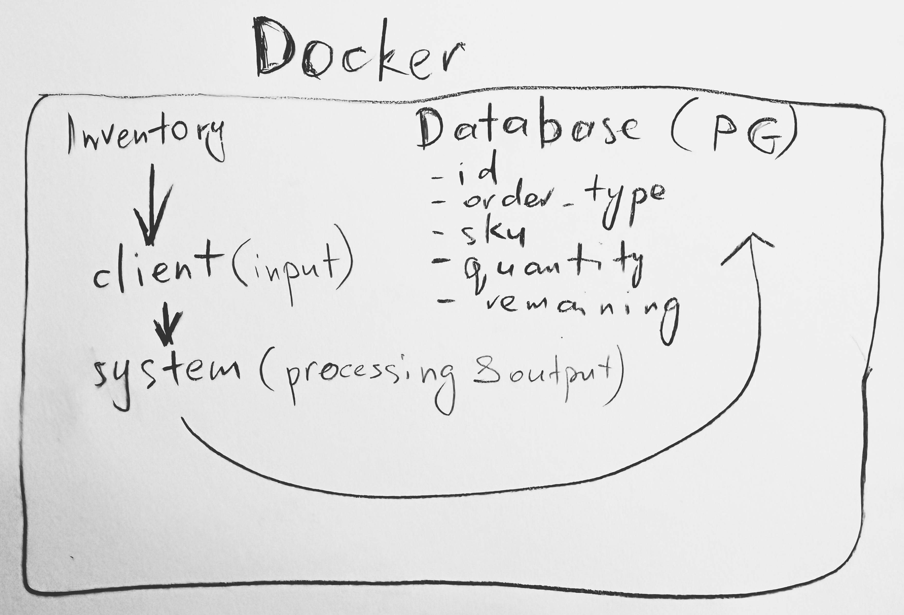

# 🍷 Selling & buying spirits (I believe Shiraz & Talisker would be the very choice 😊)

**The business logic:** we do store and consume the stuff cronologically (FIFO): first that was sold is 
the first that would be bought

## Architecture and the approach


### Order (the receipt)
Every time you sell or buy something, we create a "receipt" that remembers:
- What happened (sold or bought)
- What product (wine, whisky, etc.)
- How much (the number you typed)
- How much is left (only matters for sell orders)

So, it means:
- Each `sell` creates a new order with inventory
- Each `buy` consumes from the earliest `sell` orders
- After every command, status is either `remaining:<count>` or `closed`

### Examples:
```bash
Day 1: You sell us 1000 bottles of wine (Order #1)
Day 2: You sell us 500 more bottles (Order #2)
Day 3: You want to buy back 1200 bottles

# ℹ️ examples of the input and output

# >>> sell
client:> sell wine 1000
system:< sell wine 1000 remaining:1000

client:> sell whisky 100
system:< sell wine 1000 remaining:1000
system:< sell whisky 100 remaining:100

# >>> buy
client:> buy wine 500
system:< sell wine 1000 remaining:500
system:< sell whisky 100 remaining:100
system:< buy wine 500 closed
```

## Tech details

### How to run it locally

The service uses Docker, and we are sure you're familiar with it (or any other containerized solution)

```bash
# start the services
docker-compose build
docker-compose up -d

# the docker also inits the DB for the sake of some persistence,the SQL script it stored at scripts/init_db.sql

# connect to the client
docker-compose exec inventory ./client.sh
```

### What's inside
- `client.py` - the input. it just simply parses the input and sends the commands to the core module (`system`) to process
- `system.py` - the core thing that does the stuff:
    - works with orders (buy, sell)
    - manages the DB (initialise, load the data, clear the data)

### A few tips

#### Check DB
```bash
docker-compose exec db psql -U ferovinum -d inventory -c "SELECT * FROM orders;"
```
The sample output would be solmething like

```bash
 id | order_type |  sku   | quantity | remaining
----+------------+--------+----------+-----------
 41 | sell       | wine   |     1000 |         0
 44 | buy        | wine   |      500 |         0
 42 | sell       | whisky |      100 |         0
 45 | sell       | whisky |      100 |        80
 46 | buy        | whisky |      120 |         0
 43 | buy        | wine   |      500 |         0
(6 rows)
```

#### Clear DB
```bash
client:> clear
```